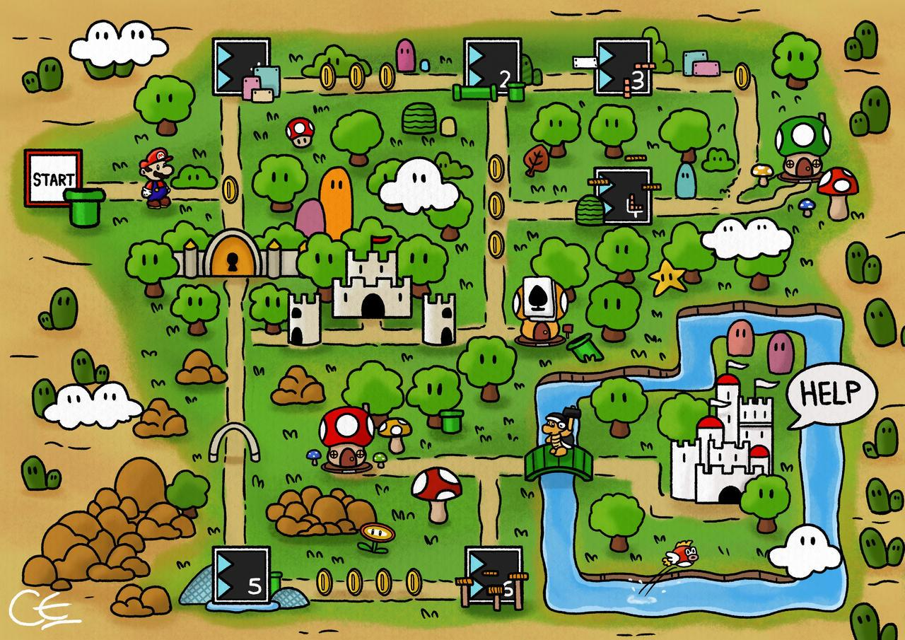

# CI/CD Workshop Code Foundry - GitHub Actions (Mario Edition)

In deze workshop/kennissessie ga je zelfstandig (of samen, you can self bepil) verschillende pipelines opzetten voor een bestaande applicatie.
Elk "level" introduceert nieuwe concepten binnen GitHub Actions en moderne CI/CD-praktijken. De levels worden natuurlijk steeds complexer, maar zijn niet afhankelijk van elkaar.
Voel je te allen tijde vrij om zelf los te gaan en te experimenteren. Alle levels en hun voorbeeldoplossingen zijn Mario‑themed, dus gaaf als je de pipeline steps ook in dat thema houdt!

De snelste zal gekroond worden (symbolisch, want heb geen echte kroon) tot de ultieme Mario, maar het is absoluut geen race (of wel... wederom, you can self bepil).
Mocht je vast komen te zitten, kan je jouw werk vergelijken met onze referentie oplossingen (de solution pipelines). NIET CHEATEN! OF wel, want...

## BELANGRIJK - LEES DIT
Zorg dat je dit project hebt geforkt! Anders krijgen we iedereen z'n pipeline runs door elkaar te zien en wordt het 1 grote chaos.

1. Ga naar de repository op GitHub.com
2. Klik rechtsboven op **Fork**
3. Selecteer je eigen account
4. Werk in jouw eigen fork

## Aan de slag - YAY
De levels zijn te vinden onder `.github/workflows`. Elk level bevat 3 bestanden:
- `level-x.yml` -> De opdracht, hier ga jij mooie dingen in bouwen!
- `level-x-README.md` -> uitleg + hints over de opdracht
- `level-x-solution.yml` -> referentie oplossing die wij hebben gemaakt om te kijken hoe het nou echt moet (zo ver onze kennis gaat)

1. LEES DE README!
2. Vul de opdracht yml aan (zie de TODO's)
3. Run via Actions tab
4. Debug voor je leven (of tot de pipeline groen is)
5. Vergelijk met de solution
6. Ga naar het volgende level

## Github Actions - BASICS

#### Starten van een workflow
1. Ga naar de repository op Github.com
2. Klik op de tab **Actions**
3. Selecteer de gewenste workflow
4. Klik op **Run workflow** (wauwwwwww)
5. Kies je branch (we houden het lekker op main)
6. Klik wederom op **Run workflow** (dubbel wauw)

#### Concepten

**Workflow:**
Een volledig pipeline bestand (`.yml`)

**Job:**
Een groep stappen die op een runner draait

**Step:**
Een individuele actie (bijv. build, test, docker build etc.)

**Runner:**
De machine waarop de pipeline draait

**Artifact:**
Output van een pipeline (bijv. jar, coverage rapport etc.)

**Contexts:**
Dynamische waarden, zoals:
`${{ github.repository }}`
`${{ github.sha }}`

## Extra

Als je tot hier hebt gelezen, koekje voor jou!
